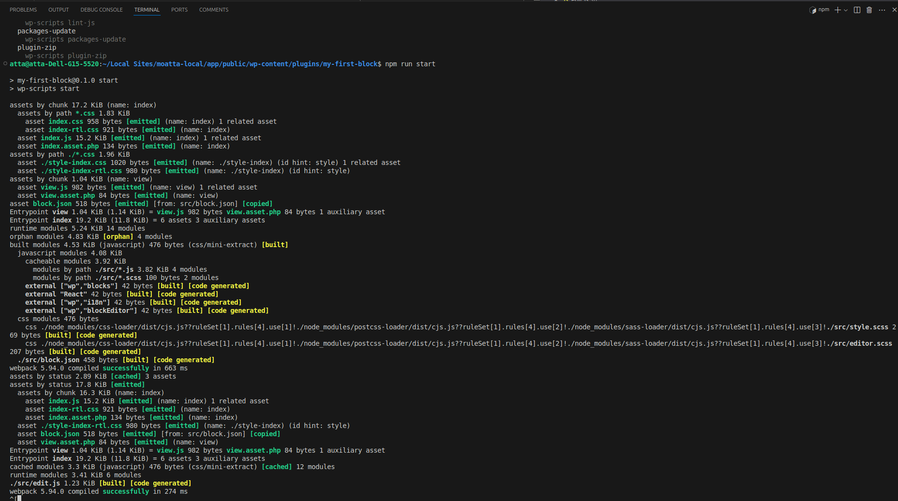

Here I am writing one more Gutenberg introduction because no one can stop me! Haha. Jokes aside, this article will serve as a documentation-style fast walkthrough on how to create a Gutenberg block from my eyes and point of view.

Prerequisites
-------------

Before diving into this article, I want to clarify that you’re free to continue reading, and no one will stop you from doing so. However, if any word or point is unclear to you, feel free to reach out to me. I’ll be more than happy to assist.

We can categorize the readers of this article into four types:

*   WordPress Developers
    *   Nothing just scroll through this section.
*   Web/fronted/backend developers
    *   You have two choices here:
        *   Dive into this article, explore a mix of React and PHP, and enjoy the ride.
        *   Take some time to learn a few terminologies and the history of WordPress to understand how we got here.
*   WordPress Users with No Coding Experience
    *   It depends on your patience. I suggest going back to some basics first to make your journey here less painful.
*   People Interested in Gutenberg (the German Craftsman)
    *   I am sorry, this is the wrong article.

Motivation(optional)
--------------------

There is a few actually

*   It's been a while since I last created Gutenberg blocks.
*   I want to have this base available so that when I work on more complex blocks, I can reference it and avoid starting from scratch each time.

 

What Gutenberg Means
--------------------

This might not seem like a strange question, especially since it's included in the WordPress Frequently Asked Questions page in the official WordPress documentation. Unfortunately, the page I was looking at didn't provide the answer I needed. It simply stated that Gutenberg is the successor to the Classic Editor, among other valid points. But really, Gutenberg refers to a real human being. I think it's important to know who Gutenberg was—after all, it adds context!

Before we continue, it's essential to know that Johannes Gutenberg was a German craftsman and inventor who developed a method of printing using movable type.

Image from [https://www.britannica.com/biography/Johannes-Gutenberg](https://www.britannica.com/biography/Johannes-Gutenberg) to be enhanced

I think it's important to know what Gutenberg refers to—haha!

What need to know before continue reading that he was a German craftsman and inventor who originated a method of printing from movable type.

In the WordPress realm, Gutenberg is often mentioned in the WordPress FAQ page.

> “Gutenberg” is the name of the project to create a new editor experience for WordPress — contributors have been working on it since January 2017 and it’s one of the most significant changes to WordPress in years. It’s built on the idea of using “blocks” to write and design posts and pages.

My Development Setup
--------------------

To get started, you'll need two essential tools:

1.  Local server

This tool allows you to run a WordPress website on your machine. For this article, I’m using Local by Flywheel.

2.  Code editor

A code editor is necessary for editing, creating, and deleting files. My editor of choice is Visual Studio Code (VSCode).

WordPress development has been around since 2003, and there are countless ways to set up a WordPress development environment. Don’t let anyone tell you that you’re doing it wrong if what you’re doing works for you. As long as your setup is functional, you’re on the right track.

For more options that might better suit your needs, you can check the [official documentation](https://developer.wordpress.org/themes/getting-started/tools-and-setup/).

Create WordPress website on Local
---------------------------------

This is a simple GUI process, so there's no need to be overwhelmed. The user experience for creating a website is excellent.

1.  In the bottom-left corner, you'll find a plus icon.
2.  Click it, follow the steps, and choose the recommended settings.

Voilà! You now have a WordPress website.

Feel free to reach out if you are facing any issues.

Generating block files
----------------------

So we need to make sure your machine is ready for this one first you need to

### Install [Node](https://nodejs.org/en)

You can check the Node [download page](https://nodejs.org/en/download/package-manager) on the official documentation to install Node.

### Navigate to the plugin Dir

On your Local app's website page, you'll find an "Site Shell" button under the website name.

This will open the terminal in the public directory.

Enter the following command:

    cd wp-content/plugins/

Then run

    npx @wordpress/create-block my-first-block

### Try the plugin

Check plugin page on dashboard

Activate and go to the editor and search the block 'My first block'

Add the block and check both Editor and Frontend

### Checking the files

I'll be referring to the [File structure of a block](https://developer.wordpress.org/block-editor/getting-started/fundamentals/file-structure-of-a-block/) from the official documentation a lot, here as it has amazing, deep info, but I will pick what we need to proceed with the tutorial.

#### All files

So first, this is how WordPress website's file structure looks like. If you want to dig deeper into that, please check [The WordPress file structure](https://learn.wordpress.org/lesson/the-wordpress-file-structure/), and if you have any questions, hit me up.

For our scope, we are checking the `my-first-block` folder. It has three folder that I will cover next, and for the files:

*   `.editorconfig`: Quoting form file description "This file is for unifying the coding style for different editors and IDEs" which means that it's some work done for developers. You don't need more knowledge in that unless you're asked, haha.
*   `.gitignore`: Here you specify what files you want Git to ignore when pushing or pulling code from remote repositories. For a deeper look, check the [Git ignore](https://www.atlassian.com/git/tutorials/saving-changes/gitignore).
*   `my-first-block.php`: This file plays a key role in registering the block with WordPress. It essentially tells the editor, "Hey, we have something here!" and ensures the block is recognized and properly loaded.
*   `package-lock.json`: Quoting from the NPM docs, "automatically generated for any operations where npm modifies either the `node_modules` tree or `package.json`." For more, go to [package-lock.json](https://docs.npmjs.com/cli/v10/configuring-npm/package-lock-json)
*   `package.json`: This one includes not just your plugin’s name and description but also essential information like CLI scripts to run, dependencies, and devDependencies. It handles a lot of important stuff, and since it's in JSON, it's easy to read and edit. For more details, read this part of the [Gutenberg handbook](https://developer.wordpress.org/block-editor/getting-started/fundamentals/file-structure-of-a-block/#package-json) and then dive into the NPM [doc](https://docs.npmjs.com/cli/v10/configuring-npm/package-json).
*   `readme.txt`: This is the markdown file for your plugin information to be displayed on the repository page.

#### Build Folder

talk about build files

#### Node modules folder

No need to check this folder; it's like a gaming backpack/jacket that can hold unlimited items or libraries you develop in your files, ready to use whenever you need them.

#### Src(source) folder

Give idea what is taht

Edit files
----------

Edit Gutenberg side output, open CLI in Plugin folder for our example it should be

    /public/wp-content/plugins/my-first-block$

Then write

    npm run start

You should be seeing something similar to this

Now open 'src/edit.js' in the your code editor

This how simple [react component](https://react.dev/learn/your-first-component#defining-a-component) look like

A React component is a reusable piece of UI that can be used throughout a React application. That returns a React element, which describes what should appear on the screen. Components can accept inputs called "props" and manage their own state.

In the provided `Edit` component example, it is a functional component that returns a paragraph element with some text. It uses the `useBlockProps` hook to apply necessary properties and the `__` function for translation.

### Play with what we created

Now replace "My first block – hello from the editor!" with any text for exmaple "Burritos are the best!" because they are

Recap
-----

Alright, here’s what we covered:

*   We set up our development environment for developing WordPress
*   Created/Generated new custom Gutenberg block files using the \``@wordpress/create-block`\`.
*   Took a quick tour of the important files.
*   Edited the `src/edit.js` file, where we played around with a simple **React component** and customized the block’s text (remember, burritos are the best!).

That’s pretty much it—you’ve built your first Gutenberg block! 🎉

Challenge
---------

*   Try adding some cool functionality to your block! For instance, instead of hardcoding the burrito text, let the user enter their favorite food. Not a burrito fan? No worries—let them type in what they love!
*   You could also explore adding more options, like letting users choose text color or size. The sky's the limit!

Experimenting with these features will help you deepen your understanding and make the block truly your own. Go ahead, have fun with it! 🚀

What is next
------------

It will have 'Gutenberg' prominently featured in the header, showcasing its significance right from the start.
